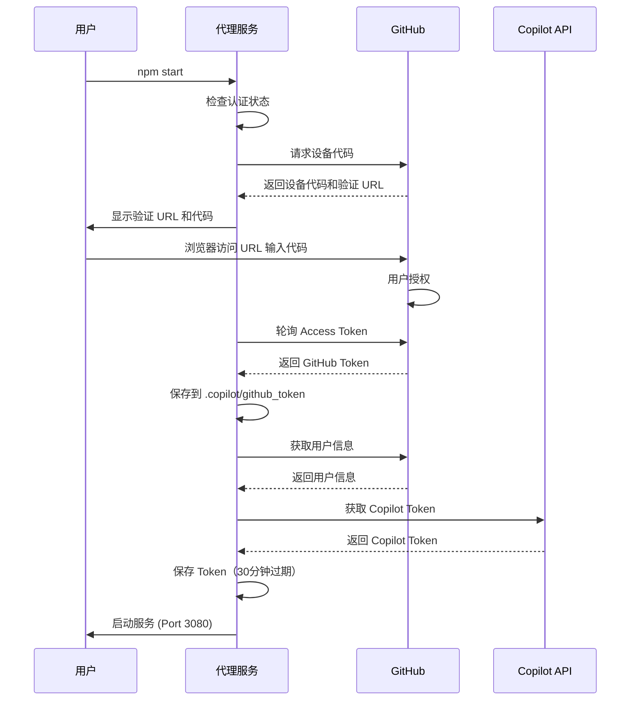
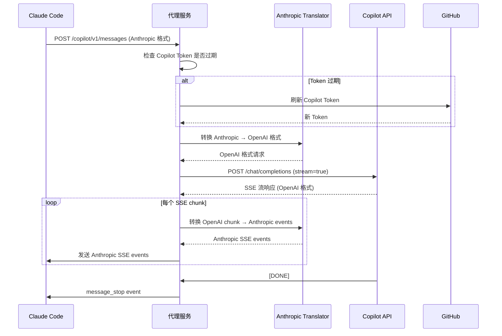
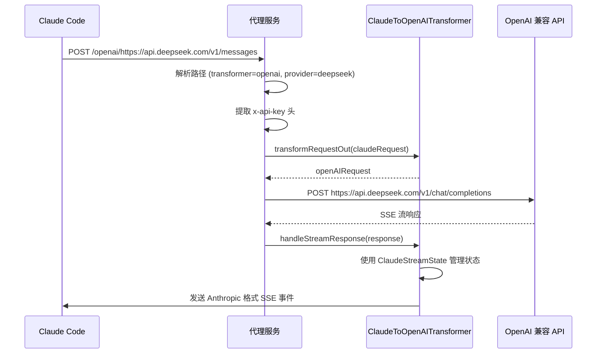
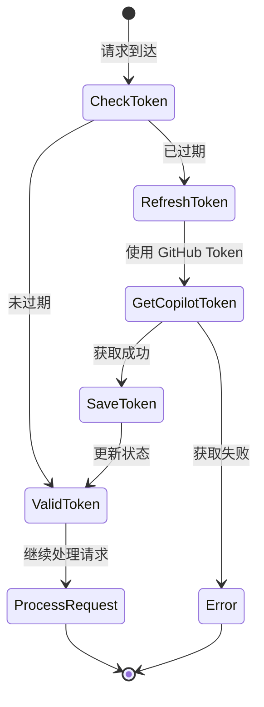

# Claude API Proxy - 业务文档

> **版本**: v1.0.0
> **作者**: Feng Shi
> **最后更新**: 2024-02-12

---

## 📋 目录

1. [项目概述](#项目概述)
2. [业务背景](#业务背景)
3. [核心功能](#核心功能)
4. [系统架构](#系统架构)
5. [业务流程](#业务流程)
6. [技术实现](#技术实现)
7. [API 接口文档](#api-接口文档)
8. [数据模型](#数据模型)
9. [部署架构](#部署架构)
10. [监控与维护](#监控与维护)

---

## 项目概述

### 1.1 项目定位

Claude API Proxy 是一个**多后端 AI 代理服务**，为 Claude Code 提供灵活的 API 后端选择。作为中间代理层，它将 Claude Code 的请求转换并路由到不同的 AI 服务提供商，实现了：

- **成本优化**: 利用 GitHub Copilot 订阅或其他更经济的 API 服务
- **服务多样化**: 支持 OpenAI、DeepSeek、GitHub Copilot 等多种后端
- **协议转换**: 自动在 Anthropic Claude 和 OpenAI 格式间转换
- **无侵入集成**: 无需修改 Claude Code 客户端

### 1.2 目标用户

- **Claude Code 用户**: 希望降低使用成本或使用替代 AI 服务
- **企业开发团队**: 需要统一管理 AI API 调用和成本控制
- **个人开发者**: 已有 GitHub Copilot 订阅，希望为 Claude Code 复用

### 1.3 核心价值

| 价值点 | 说明 |
|--------|------|
| 成本节约 | 通过 GitHub Copilot 订阅使用 Claude Code，无需额外 API 费用 |
| 灵活性 | 支持多种 AI 后端，自由切换无需重启 |
| 兼容性 | 完全兼容 Claude Code，零学习成本 |
| 自动化 | Token 自动管理和刷新，无需手动维护 |

---

## 业务背景

### 2.1 问题场景

Claude Code 默认调用 Anthropic 的 Claude API，存在以下问题：

1. **成本问题**: Anthropic API 按 token 计费，高频使用成本较高
2. **服务限制**: 仅能使用 Anthropic 的服务，无法选择其他更经济的替代方案
3. **资源浪费**: 部分用户已有 GitHub Copilot 订阅，无法复用

### 2.2 解决方案

本项目通过**代理+转换**的方式解决上述问题：

```
Claude Code → 本地代理 (3080) → 协议转换 → 目标 AI 服务
                ↓
        - GitHub Copilot
        - DeepSeek
        - OpenAI
        - 其他兼容服务
```

### 2.3 业务模式

#### 模式一：GitHub Copilot 模式（推荐）

**适用场景**: 已有 GitHub Copilot 订阅的用户

- **优势**: 零额外成本，自动 Token 管理
- **路由**: `/copilot/v1/messages`
- **认证**: GitHub OAuth 设备流程

#### 模式二：OpenAI 兼容 API 模式

**适用场景**: 使用 DeepSeek、OpenAI 等服务的用户

- **优势**: 灵活选择更经济的服务商
- **路由**: `/openai/{provider_url}/v1/messages`
- **认证**: API Key

---

## 核心功能

### 3.1 功能列表

| 功能模块 | 功能点 | 业务价值 |
|---------|--------|---------|
| **协议转换** | Claude ↔ OpenAI 格式互转 | 实现跨平台兼容 |
| **流式响应** | SSE (Server-Sent Events) 支持 | 实时响应，提升用户体验 |
| **Token 管理** | GitHub Token 自动获取和存储 | 降低用户操作成本 |
| | Copilot Token 自动刷新（30分钟过期） | 保证服务连续性 |
| **多后端支持** | GitHub Copilot 集成 | 复用现有订阅 |
| | OpenAI 兼容 API 路由 | 支持任意兼容服务 |
| **请求路由** | 智能路径解析 | 自动识别目标后端 |
| | API Key 提取和转发 | 安全的凭证管理 |
| **状态管理** | 认证状态持久化 | 减少重复认证 |
| | 用户信息缓存 | 提升性能 |

### 3.2 功能详解

#### 3.2.1 协议转换器（Transformer）

**ClaudeToOpenAITransformer** 负责核心的协议转换：

- **请求转换** (`transformRequestOut`):
  - Claude Messages API → OpenAI Chat Completions API
  - 处理 tools/functions 定义
  - 清理 JSON Schema（移除不兼容字段）

- **响应转换** (`handleStreamResponse`):
  - OpenAI SSE 流 → Claude SSE 流
  - 管理消息生命周期（start/delta/stop）
  - 处理多种内容类型：text、thinking、tool_use
  - 解决重复输出问题（通过状态机控制）

#### 3.2.2 GitHub Copilot 集成

**认证流程** (OAuth Device Flow):

```
1. 获取设备代码 → /login/device/code
2. 用户浏览器授权 → github.com/login/device
3. 轮询获取 Access Token
4. 获取用户信息 → /api/v3/user
5. 获取 Copilot Token → /api/v1/token
```

**Token 生命周期管理**:

- **GitHub Token**: 长期有效，存储在 `.copilot/github_token`
- **Copilot Token**: 30 分钟过期，自动刷新

#### 3.2.3 路由系统

**路径解析规则**:

```
模式一（Copilot）: /copilot/v1/messages
模式二（OpenAI）: /{transformer_type}/{provider_url}/v1/messages

示例:
/openai/https://api.deepseek.com/v1/messages
  ↓
  - transformer_type: openai
  - provider_url: https://api.deepseek.com
```

---

## 系统架构

### 4.1 整体架构

```
┌─────────────────────────────────────────────────────────┐
│                      Claude Code 客户端                   │
│            (配置 ANTHROPIC_BASE_URL)                      │
└─────────────────────┬───────────────────────────────────┘
                      │ HTTP/SSE
                      ↓
┌─────────────────────────────────────────────────────────┐
│                   本地代理服务 (Port 3080)                │
│  ┌───────────────────────────────────────────────────┐  │
│  │              HTTP Server (Node.js)                │  │
│  └───────────┬──────────────────────┬────────────────┘  │
│              │                      │                    │
│    ┌─────────▼──────────┐  ┌───────▼──────────────┐   │
│    │  Copilot 路由       │  │  OpenAI 路由         │   │
│    │  /copilot/*        │  │  /openai/*           │   │
│    └─────────┬──────────┘  └───────┬──────────────┘   │
│              │                      │                    │
│    ┌─────────▼──────────┐  ┌───────▼──────────────┐   │
│    │ Anthropic Translator│  │ ClaudeToOpenAI       │   │
│    │ (格式转换)          │  │ Transformer          │   │
│    └─────────┬──────────┘  └───────┬──────────────┘   │
│              │                      │                    │
│    ┌─────────▼──────────┐          │                    │
│    │  认证管理           │          │                    │
│    │  - GitHub OAuth    │          │                    │
│    │  - Token 刷新      │          │                    │
│    │  - 状态持久化      │          │                    │
│    └────────────────────┘          │                    │
└──────────┬─────────────────────────┼────────────────────┘
           │                         │
           ↓                         ↓
┌──────────────────────┐  ┌──────────────────────┐
│  GitHub Copilot API  │  │  OpenAI 兼容 API     │
│  - Chat Completions  │  │  - DeepSeek          │
│  - Models            │  │  - OpenAI            │
└──────────────────────┘  │  - 其他服务          │
                          └──────────────────────┘
```

### 4.2 模块架构

```
src/
├── index.js                    # 应用入口，服务启动
├── server.js                   # HTTP 服务器创建
├── router.js                   # 路由解析器
├── start.js                    # 启动脚本
│
├── routes/
│   └── copilot.js             # Copilot 模式路由处理
│
├── services/
│   ├── transformer.js         # Transformer 服务管理
│   │
│   └── copilot/               # Copilot 集成模块
│       ├── auth.js            # 认证管理
│       ├── github-api.js      # GitHub API 调用
│       ├── copilot-api.js     # Copilot API 调用
│       ├── anthropic-translator.js  # Anthropic 格式转换
│       ├── config.js          # 配置管理
│       └── state.js           # 状态管理（Token、用户信息）
│
├── transformer/               # 转换器实现
│   ├── index.js              # Transformer 注册
│   └── claude-to-openai.js   # Claude → OpenAI 转换器
│
└── utils/                     # 工具模块
    ├── converter.js          # 格式转换工具
    ├── helpers.js            # 辅助函数
    ├── logger.js             # 日志系统
    └── http-client.js        # HTTP 客户端
```

### 4.3 核心类设计

#### TransformerService

```javascript
class TransformerService {
    - transformers: Map<name, transformer>
    - logger

    + registerTransformer(name, transformer)
    + getTransformer(name)
    + getAllTransformers()
    + initialize()
}
```

#### ClaudeStreamState

```javascript
class ClaudeStreamState {
    - messageId, model
    - blockIndex (内容块计数)
    - thinking, text, tool 状态

    + startMessage(model)
    + appendText(text)
    + startTool(index, name)
    + endMessage(stopReason)
}
```

#### CopilotState

```javascript
class CopilotState {
    - githubToken
    - copilotToken, expiresAt
    - userInfo

    + saveGithubToken(token)
    + saveCopilotToken(token, expiresAt)
    + isCopilotTokenExpired()
    + loadState() / saveState()
}
```

---

## 业务流程

### 5.1 首次启动流程（Copilot 模式）



### 5.2 Claude Code 请求处理流程

#### 5.2.1 Copilot 模式流式请求



#### 5.2.2 OpenAI 模式请求



### 5.3 Token 自动刷新流程



---

## 技术实现

### 6.1 核心技术栈

| 技术 | 版本 | 用途 |
|------|------|------|
| Node.js | ≥18.0.0 | 运行时环境 |
| HTTP/HTTPS | 原生模块 | 服务器和客户端 |
| SSE | 原生实现 | 流式响应 |
| dotenv | ^17.2.4 | 环境变量管理 |
| https-proxy-agent | ^7.0.6 | HTTPS 代理支持 |
| socks-proxy-agent | ^8.0.5 | SOCKS 代理支持 |

### 6.2 关键技术点

#### 6.2.1 SSE (Server-Sent Events) 实现

**发送端（代理服务）**:

```javascript
res.writeHead(200, {
    'Content-Type': 'text/event-stream',
    'Cache-Control': 'no-cache',
    'Connection': 'keep-alive'
});

// 发送事件
res.write(`event: message_start\n`);
res.write(`data: ${JSON.stringify(data)}\n\n`);
```

**接收端处理**:

```javascript
// 逐行解析 SSE 流
buffer += chunk.toString('utf8');
const lines = buffer.split('\n');
buffer = lines.pop() || ''; // 保留不完整行

for (const line of lines) {
    if (line.startsWith('data: ')) {
        const data = line.slice(6);
        // 处理 JSON 数据
    }
}
```

#### 6.2.2 状态机设计（ClaudeStreamState）

**问题**: 如何将 OpenAI 的单一流转换为 Claude 的多事件流？

**解决方案**: 使用状态机跟踪每个内容块的生命周期

```javascript
状态转换:
  thinking:  CLOSED → OPEN (start) → WRITING → CLOSED (signature)
  text:      CLOSED → OPEN (start) → WRITING → CLOSED (stop)
  tool_use:  CLOSED → OPEN (start) → WRITING (args) → CLOSED (stop)

事件序列:
  1. message_start (一次)
  2. content_block_start (每个块)
  3. content_block_delta (多次)
  4. content_block_stop (每个块)
  5. message_delta (一次)
  6. message_stop (一次)
```

#### 6.2.3 Token 过期处理

**策略**: 主动检查 + 自动刷新

```javascript
isCopilotTokenExpired() {
    if (!this.copilotToken || !this.expiresAt) return true;
    const buffer = 5 * 60 * 1000; // 5 分钟缓冲
    return Date.now() >= (this.expiresAt - buffer);
}

async ensureCopilotToken() {
    if (copilotState.isCopilotTokenExpired()) {
        await refreshCopilotToken();
    }
    return copilotState.copilotToken;
}
```

#### 6.2.4 JSON Schema 清理

**问题**: OpenAI 不支持某些 JSON Schema 关键字

**解决方案**: 递归清理不兼容字段

```javascript
cleanJsonSchema(schema) {
    const cleaned = {...schema};
    delete cleaned.$schema;
    delete cleaned.$comment;

    // 递归处理嵌套对象
    if (cleaned.properties) {
        for (const key in cleaned.properties) {
            cleaned.properties[key] = cleanJsonSchema(cleaned.properties[key]);
        }
    }
    return cleaned;
}
```

---

## API 接口文档

### 7.1 Copilot 模式端点

#### 7.1.1 发送消息（主端点）

**端点**: `POST /copilot/v1/messages`

**用途**: Claude Code 发送消息的主要接口

**请求头**:
```http
Content-Type: application/json
x-api-key: <任意值，Copilot 模式忽略>
anthropic-version: 2023-06-01
```

**请求体** (Anthropic 格式):
```json
{
    "model": "claude-3-5-sonnet-20241022",
    "max_tokens": 4096,
    "stream": true,
    "messages": [
        {
            "role": "user",
            "content": "Hello, Claude!"
        }
    ],
    "system": "You are a helpful assistant.",
    "tools": [...]  // 可选
}
```

**响应** (SSE 流):
```
event: message_start
data: {"type":"message_start","message":{...}}

event: content_block_start
data: {"type":"content_block_start","index":0,"content_block":{...}}

event: content_block_delta
data: {"type":"content_block_delta","index":0,"delta":{...}}

event: content_block_stop
data: {"type":"content_block_stop","index":0}

event: message_delta
data: {"type":"message_delta","delta":{...}}

event: message_stop
data: {"type":"message_stop"}
```

**错误响应**:
```json
{
    "type": "error",
    "error": {
        "type": "api_error",
        "message": "Not authenticated. Please complete GitHub authentication first."
    }
}
```

#### 7.1.2 Token 计数

**端点**: `POST /copilot/v1/messages/count_tokens`

**用途**: 估算消息的 token 数量

**请求体**:
```json
{
    "model": "claude-3-5-sonnet-20241022",
    "messages": [...]
}
```

**响应**:
```json
{
    "input_tokens": 1250
}
```

#### 7.1.3 获取模型列表

**端点**: `GET /copilot/v1/models`

**用途**: 获取 GitHub Copilot 支持的所有模型

**响应**:
```json
{
    "object": "list",
    "data": [
        {
            "id": "gpt-4.1",
            "object": "model",
            "created": 0,
            "owned_by": "openai",
            "name": "GPT-4.1",
            "version": "2024-01-01",
            "capabilities": {
                "type": "chat",
                "limits": {
                    "max_prompt_tokens": 128000,
                    "max_context_window": 128000
                }
            }
        }
    ]
}
```

#### 7.1.4 服务信息

**端点**: `GET /copilot`

**用途**: 获取代理服务状态和配置信息

**响应**:
```json
{
    "name": "GitHub Copilot API Proxy",
    "version": "1.0.0",
    "mode": "Claude Code Compatible",
    "authenticated": true,
    "user": {
        "login": "username",
        "id": 12345,
        "email": "user@example.com"
    },
    "endpoints": {
        "messages": "POST /copilot/v1/messages - Claude Code messages endpoint",
        "countTokens": "POST /copilot/v1/messages/count_tokens - Token counting",
        "models": "GET /copilot/v1/models - List available models"
    },
    "configuration": {
        "autoAuth": true,
        "tokenSource": ".copilot/github_token"
    }
}
```

### 7.2 OpenAI 模式端点

#### 7.2.1 发送消息

**端点**: `POST /{transformer_type}/{provider_url}/v1/messages`

**示例**: `POST /openai/https://api.deepseek.com/v1/messages`

**请求头**:
```http
Content-Type: application/json
x-api-key: sk-xxxxxxxxxxxxx  # 目标服务的 API Key
anthropic-version: 2023-06-01
```

**请求体**: 同 Copilot 模式

**响应**: 同 Copilot 模式

### 7.3 健康检查

**端点**: `GET /health`

**响应**:
```json
{
    "status": "ok",
    "timestamp": 1707724800000
}
```

---

## 数据模型

### 8.1 Anthropic Messages API 格式

#### Request
```typescript
interface AnthropicRequest {
    model: string;
    max_tokens: number;
    stream?: boolean;
    messages: Message[];
    system?: string;
    tools?: Tool[];
    temperature?: number;
}

interface Message {
    role: 'user' | 'assistant';
    content: string | ContentBlock[];
}

interface ContentBlock {
    type: 'text' | 'image' | 'tool_use' | 'tool_result';
    // ... 类型特定字段
}
```

#### Response (SSE Events)
```typescript
// 1. message_start
{
    type: 'message_start',
    message: {
        id: string,
        type: 'message',
        role: 'assistant',
        content: [],
        model: string,
        stop_reason: null,
        stop_sequence: null,
        usage: { input_tokens: number, output_tokens: number }
    }
}

// 2. content_block_start
{
    type: 'content_block_start',
    index: number,
    content_block: {
        type: 'text' | 'thinking' | 'tool_use',
        text?: '',
        thinking?: '',
        id?: string,
        name?: string,
        input?: {}
    }
}

// 3. content_block_delta
{
    type: 'content_block_delta',
    index: number,
    delta: {
        type: 'text_delta' | 'thinking_delta' | 'input_json_delta',
        text?: string,
        thinking?: string,
        partial_json?: string
    }
}

// 4. content_block_stop
{
    type: 'content_block_stop',
    index: number
}

// 5. message_delta
{
    type: 'message_delta',
    delta: {
        stop_reason: 'end_turn' | 'max_tokens' | 'tool_use',
        stop_sequence: null
    },
    usage: { output_tokens: number }
}

// 6. message_stop
{
    type: 'message_stop'
}
```

### 8.2 OpenAI Chat Completions API 格式

#### Request
```typescript
interface OpenAIRequest {
    model: string;
    messages: OpenAIMessage[];
    max_tokens?: number;
    stream?: boolean;
    tools?: OpenAITool[];
    temperature?: number;
}

interface OpenAIMessage {
    role: 'system' | 'user' | 'assistant' | 'tool';
    content: string;
    name?: string;
    tool_calls?: ToolCall[];
    tool_call_id?: string;
}

interface ToolCall {
    id: string;
    type: 'function';
    function: {
        name: string;
        arguments: string;  // JSON string
    };
}
```

#### Response (SSE)
```typescript
{
    id: string,
    object: 'chat.completion.chunk',
    created: number,
    model: string,
    choices: [
        {
            index: 0,
            delta: {
                role?: 'assistant',
                content?: string,
                reasoning_content?: string,  // thinking
                tool_calls?: [
                    {
                        index: number,
                        id?: string,
                        type?: 'function',
                        function?: {
                            name?: string,
                            arguments?: string
                        }
                    }
                ]
            },
            finish_reason?: 'stop' | 'length' | 'tool_calls'
        }
    ]
}
```

### 8.3 格式转换映射

| Anthropic | OpenAI | 说明 |
|-----------|--------|------|
| `messages` | `messages` | 消息数组 |
| `system` (string) | `messages[0]` (role=system) | 系统提示 |
| `tools` | `tools` | 工具定义 |
| `tool_use` | `tool_calls` | 工具调用 |
| `tool_result` | `tool` message | 工具结果 |
| `thinking` | `reasoning_content` | 思考内容 |
| `stop_reason: 'tool_use'` | `finish_reason: 'tool_calls'` | 停止原因 |
| `stop_reason: 'max_tokens'` | `finish_reason: 'length'` | Token 限制 |

---

## 部署架构

### 9.1 本地开发部署

```bash
# 1. 克隆项目
git clone <repository_url>
cd claude-api-proxy

# 2. 安装依赖
npm install

# 3. 启动服务（首次会引导认证）
npm start

# 4. 配置 Claude Code
# 编辑 ~/.claude/settings.json
{
    "env": {
        "ANTHROPIC_BASE_URL": "http://127.0.0.1:3080/copilot",
        "ANTHROPIC_AUTH_TOKEN": "dummy",
        // ... 其他配置
    }
}
```

### 9.2 生产环境部署（PM2）

```bash
# 1. 安装 PM2
npm install -g pm2

# 2. 启动服务
pm2 start ecosystem.config.cjs

# 3. 保存进程列表
pm2 save

# 4. 设置开机自启
pm2 startup

# 5. 监控
pm2 monit
```

**ecosystem.config.cjs**:
```javascript
module.exports = {
    apps: [{
        name: 'ClaudeApiProxy',
        script: 'src/index.js',
        instances: 1,
        autorestart: true,
        watch: false,
        max_memory_restart: '500M',
        env: {
            NODE_ENV: 'production',
            PORT: 3080,
            HOST: '0.0.0.0',
            LOG_LEVEL: 'INFO'
        }
    }]
};
```

### 9.3 Docker 部署（推荐）

**Dockerfile**:
```dockerfile
FROM node:18-alpine
WORKDIR /app
COPY package*.json ./
RUN npm ci --only=production
COPY . .
EXPOSE 3080
CMD ["node", "src/index.js"]
```

**docker-compose.yml**:
```yaml
version: '3.8'
services:
  claude-proxy:
    build: .
    ports:
      - "3080:3080"
    volumes:
      - ./.copilot:/app/.copilot
      - ./.env:/app/.env
    environment:
      - PORT=3080
      - LOG_LEVEL=INFO
    restart: unless-stopped
```

### 9.4 网络架构

#### 方案一：单机部署
```
[Claude Code] → [本地代理:3080] → [GitHub/OpenAI API]
     同一台机器
```

#### 方案二：局域网部署
```
[多台 Claude Code 客户端] → [代理服务器:3080] → [GitHub/OpenAI API]
         ↓
     配置 ANTHROPIC_BASE_URL=http://<server_ip>:3080/copilot
```

#### 方案三：云端部署（需反向代理）
```
[Claude Code] → [Nginx/Caddy (HTTPS)] → [代理服务:3080] → [GitHub/OpenAI API]
                        ↓
                 SSL/TLS 终止
                 负载均衡
```

---

## 监控与维护

### 10.1 日志系统

#### 日志级别

| 级别 | 用途 | 示例 |
|------|------|------|
| `DEBUG` | 详细调试信息 | 请求/响应完整内容 |
| `INFO` | 常规操作日志 | 请求开始、认证成功 |
| `WARN` | 警告信息 | Token 即将过期 |
| `ERROR` | 错误信息 | API 调用失败 |

#### 配置方式

```bash
# 环境变量
LOG_LEVEL=DEBUG npm start

# 或在 .env 文件中
LOG_LEVEL=DEBUG
```

#### 日志示例

```log
[INFO] Starting GitHub device authentication flow...
[INFO] Please visit: https://github.com/login/device
[INFO] And enter code: XXXX-XXXX
[INFO] Successfully authenticated as username
[INFO] Copilot request: POST /copilot/v1/messages
[DEBUG] Anthropic payload: {"model":"claude-3-5-sonnet",...}
[DEBUG] OpenAI payload: {"model":"gpt-4",...}
[ERROR] Failed to handle messages: Token expired
```

### 10.2 性能监控

#### 关键指标

| 指标 | 说明 | 监控方法 |
|------|------|---------|
| 请求延迟 | 端到端响应时间 | 添加时间戳日志 |
| Token 刷新频率 | Copilot Token 刷新次数 | 日志统计 |
| 错误率 | 失败请求占比 | 错误日志计数 |
| 并发连接数 | 同时处理的请求数 | 服务器监控 |

#### 监控脚本示例

```bash
# 查看最近 100 次请求的平均响应时间
tail -100 pm2.log | grep "response time" | awk '{sum+=$NF} END {print sum/NR "ms"}'

# 统计错误率
tail -1000 pm2.log | grep -c "ERROR" | awk '{print $1/1000*100 "%"}'
```

### 10.3 故障排查

#### 常见问题清单

| 问题 | 可能原因 | 解决方法 |
|------|---------|---------|
| 服务无法启动 | 端口被占用 | `lsof -i :3080` 查看占用，更改端口 |
| 认证失败 | GitHub Token 过期 | `rm .copilot/github_token && npm start` |
| Claude Code 无法连接 | 配置错误 | 检查 `~/.claude/settings.json` |
| 流式响应卡住 | 网络问题/API 超时 | 增加 `API_TIMEOUT_MS` |
| Token 频繁过期 | 系统时间不正确 | 同步系统时间 `ntpdate` |

#### 诊断命令

```bash
# 1. 检查服务状态
curl http://127.0.0.1:3080/health

# 2. 测试 Copilot 端点
curl -X POST http://127.0.0.1:3080/copilot/v1/messages \
  -H "Content-Type: application/json" \
  -d '{"model":"gpt-4","messages":[{"role":"user","content":"Hi"}],"stream":false,"max_tokens":50}'

# 3. 查看 GitHub Token
cat .copilot/github_token

# 4. 检查 Copilot Token 过期时间
cat .copilot/state.json | jq '.expiresAt'

# 5. 查看 PM2 日志
pm2 logs ClaudeApiProxy --lines 50
```

### 10.4 安全建议

#### Token 安全

1. **文件权限**: 确保 `.copilot/` 目录权限为 `700`
   ```bash
   chmod 700 .copilot
   chmod 600 .copilot/*
   ```

2. **版本控制**: `.copilot/` 已在 `.gitignore` 中，避免提交

3. **环境隔离**: 生产环境使用独立的 GitHub 账号

#### 网络安全

1. **防火墙**: 仅允许本地或信任 IP 访问端口 3080
   ```bash
   # iptables 示例
   iptables -A INPUT -p tcp --dport 3080 -s 192.168.1.0/24 -j ACCEPT
   iptables -A INPUT -p tcp --dport 3080 -j DROP
   ```

2. **HTTPS**: 生产环境使用 Nginx/Caddy 提供 TLS 加密

3. **API Key 管理**: OpenAI 模式的 API Key 通过环境变量传递，不硬编码

### 10.5 升级与维护

#### 常规维护

```bash
# 1. 备份配置和 Token
cp -r .copilot .copilot.backup
cp .env .env.backup

# 2. 更新代码
git pull

# 3. 更新依赖
npm install

# 4. 重启服务
pm2 restart ClaudeApiProxy

# 5. 验证
curl http://127.0.0.1:3080/health
```

#### 版本回滚

```bash
# 1. 停止服务
pm2 stop ClaudeApiProxy

# 2. 回滚代码
git reset --hard <commit_hash>

# 3. 恢复依赖
npm ci

# 4. 重启服务
pm2 start ecosystem.config.cjs
```

---

## 附录

### A. 环境变量完整列表

| 变量名 | 类型 | 默认值 | 说明 |
|--------|------|--------|------|
| `PORT` | Number | `3080` | 服务监听端口 |
| `HOST` | String | `0.0.0.0` | 服务绑定地址 |
| `LOG_LEVEL` | String | `INFO` | 日志级别 (DEBUG/INFO/WARN/ERROR) |
| `COPILOT_AUTO_AUTH` | Boolean | `true` | 是否自动进行 GitHub 认证 |
| `API_TIMEOUT_MS` | Number | `120000` | API 请求超时时间（毫秒） |

### B. Claude Code 配置模板

#### Copilot 模式
```json
{
    "env": {
        "ANTHROPIC_AUTH_TOKEN": "dummy",
        "ANTHROPIC_BASE_URL": "http://127.0.0.1:3080/copilot",
        "ANTHROPIC_DEFAULT_HAIKU_MODEL": "gpt-4.1",
        "ANTHROPIC_DEFAULT_SONNET_MODEL": "gpt-4.1",
        "ANTHROPIC_DEFAULT_OPUS_MODEL": "gpt-4.1",
        "API_TIMEOUT_MS": "60000",
        "CLAUDE_CODE_DISABLE_NONESSENTIAL_TRAFFIC": "1"
    }
}
```

#### DeepSeek 模式
```json
{
    "env": {
        "ANTHROPIC_AUTH_TOKEN": "xxx",
        "ANTHROPIC_BASE_URL": "http://127.0.0.1:3080/openai/https://api.deepseek.com",
        "ANTHROPIC_CUSTOM_HEADERS": "x-api-key: sk-xxxxxxxxxxxxx",
        "ANTHROPIC_DEFAULT_HAIKU_MODEL": "deepseek-chat",
        "ANTHROPIC_DEFAULT_SONNET_MODEL": "deepseek-chat",
        "ANTHROPIC_DEFAULT_OPUS_MODEL": "deepseek-reasoner",
        "API_TIMEOUT_MS": "60000",
        "CLAUDE_CODE_DISABLE_NONESSENTIAL_TRAFFIC": "1"
    }
}
```

### C. 相关资源

- **GitHub Copilot API 文档**: (逆向工程)
- **Anthropic Claude API**: https://docs.anthropic.com/claude/reference
- **OpenAI API 文档**: https://platform.openai.com/docs/api-reference
- **PM2 文档**: https://pm2.keymetrics.io/docs/usage/quick-start/

---

## 文档修订历史

| 版本 | 日期 | 修订内容 | 作者 |
|------|------|---------|------|
| v1.0.0 | 2024-02-12 | 初始版本，完整业务文档 | Feng Shi |

---

**© 2024 Claude API Proxy Project | MIT License**
