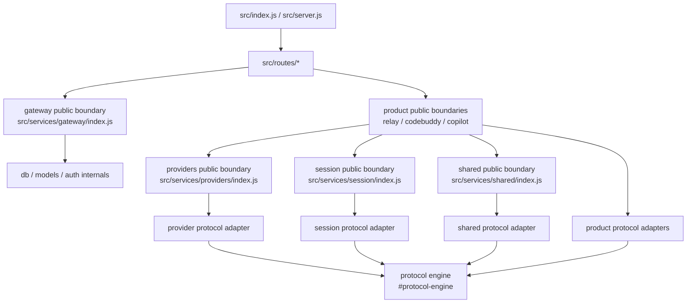

# 架构边界约定

本文档记录当前分层边界，目标是让协议转换核心、租户鉴权、产品接入和路由入口保持清晰。后续新增客户端或 Provider 时，优先遵守这里的依赖方向，不要把特殊逻辑重新堆回路由层。

## 总体分层



## 层级职责

`src/protocol-engine`

- 拥有 Canonical Session、Canonical Block、协议 schema、请求/响应/stream 渲染和转换。
- 只能通过 `#protocol-engine` public import 进入应用层。
- 不得 import `routes`、`services`、`utils/logger`、业务配置或数据库。

`src/services/*/protocol-adapter.js`

- 是业务服务访问协议引擎的唯一入口。
- 负责把产品侧命名、行为规则和协议引擎 API 对接起来。
- 产品服务中除 `protocol-adapter.js` 以外的文件，不应直接 import `#protocol-engine`。

`src/services/gateway`

- 拥有跨产品网关能力：API Key 鉴权、Dashboard session、认证模式、本地/LDAP 登录门面、租户管理、用户管理、统计查询和反馈持久化。
- 可以访问 `db/models`、Sequelize、shared auth internals。
- 对外只暴露 `src/services/gateway/index.js`。
- 不拥有 Relay、CodeBuddy、Copilot 的协议运行时，也不持有产品凭据管理细节。

`src/services/relay`、`src/services/codebuddy`、`src/services/copilot`

- 拥有各自产品接入、请求编排、上游上下文、usage 记录、metadata endpoint、response writer、WebSocket runtime。
- 对外只暴露各自 `index.js`。
- 不直接 import gateway singleton。需要租户、鉴权、usage 写入能力时，通过 route runtime 注入。
- 不直接访问 DB。产品凭据持久化例外只能留在对应产品 service 内部，例如 CodeBuddy/Copilot credential manager。

`src/services/providers`

- 拥有上游 transport、stream response、upstream manager、网络错误归一化。
- 不 import routes、gateway、relay、codebuddy、copilot。
- 协议相关能力通过 provider protocol adapter 触达 `#protocol-engine`。

`src/services/session`

- 拥有 conversation store、Responses continuation、context compaction、diagnostics。
- 不 import routes、gateway、产品服务。
- 协议转换只能通过 session protocol adapter。

`src/services/shared`

- 放置真正跨产品的底层工具，例如 Responses WS client/server/pool、behavior rules、auth internals。
- 不 import gateway 或产品服务。
- 如果上层需要 shared auth 能力，应由 gateway public boundary 暴露。

`src/routes`

- 只做 HTTP 解析、路径分发、状态码和响应写出。
- 只能 import gateway public boundary 与产品 public boundary。
- 不直接访问 DB、Sequelize、protocol engine、provider internals、session internals、shared auth internals。

## 依赖方向

允许：

- `routes -> services/gateway/index.js`
- `routes -> services/{relay,codebuddy,copilot}/index.js`
- `index/server -> services/gateway/index.js`
- `product services -> services/{providers,session,shared}/index.js`
- `protocol-adapter.js -> #protocol-engine`
- `gateway -> db/models`
- `gateway -> shared auth internals`

禁止：

- `routes -> db/models`
- `routes -> sequelize`
- `routes -> #protocol-engine`
- `routes -> services/*/private-file.js`
- `routes -> services/shared/auth-mode.js`
- `routes -> services/shared/local-auth.js`
- `routes -> services/shared/ldap-auth.js`
- `product services -> services/gateway/*`
- `protocol-engine -> services/routes/db/utils`

## 协议转换规则

协议转换不再以入口协议和目标协议的直接互转矩阵作为主要维护面。保留 16 条通路，但转换路径应是：

```text
入口协议
  -> product protocol adapter
  -> Canonical Session / Canonical Stream Event
  -> Renderer
  -> 目标协议
```

新增协议或新增产品接入时，优先补齐：

- request to canonical
- response to canonical
- stream event to canonical
- canonical to target renderer
- product protocol adapter facade

不要在 route handler 中写 `Anthropic -> OpenAI Chat`、`Responses -> Anthropic` 这类直接转换逻辑。

## Session 与历史规则

必须保存：

- 足够恢复多轮历史的 canonical turns。
- 协议原生 ID 映射，例如 OpenAI Chat `tool_call_id`、Responses `call_id`/`item_id`、Anthropic `tool_use_id`。
- 最近请求所需的轻量 chat cache 或 continuation index。
- diagnostics 需要的计数、截断状态和热点摘要。

不能无限保存：

- 完整 request body 的历史无限追加。
- 完整 response body 的历史无限追加。
- 完整 stream event 序列。
- 未截断的 tool argument buffer、reasoning buffer、delta buffer。

缓存必须有上限，且上限策略要避免切断 tool_call 与 tool_result 的闭环。

## Tool Calling 规则

Canonical 层必须把同一个工具调用的多协议 ID 统一到稳定映射中：

- canonical tool call id
- OpenAI Chat `tool_call_id`
- Responses `call_id`
- Responses `item_id`
- Anthropic `tool_use_id`

每个 assistant tool call 都应能找到对应 tool result。允许 diagnostics 报告缺失或孤儿结果，但渲染器不能悄悄生成不一致 ID。

## Stream 规则

Stream 处理只保存当前重建最终响应所需的最小状态：

- text delta accumulator
- reasoning accumulator
- tool argument accumulator
- 当前 open item / open block 标记

Stream 完成或异常结束时，必须释放或 finalize open buffer。对于缺失 completed 事件的上游，应通过 accumulator 生成可诊断的最终状态，而不是保留半包状态继续增长。

## 当前边界测试

以下测试负责守住主要边界：

- `tests/protocol-engine-boundary.test.js`
- `tests/service-adapter-boundary.test.js`
- `tests/gateway-boundary.test.js`
- `tests/provider-boundary.test.js`
- `tests/session-boundary.test.js`
- `tests/relay-conversation-diagnostics.test.js`
- `tests/protocol-canonical-session.test.js`
- `tests/protocol-stream-bridge.test.js`

如果某次改动必须突破边界，应先修改本文档并补充对应测试，再改生产代码。

## Backlog

以下事项暂缓，等待真实问题驱动：

- 继续拆分产品 service 内部的细粒度模块。
- 为 dashboard 管理路由继续抽更细的 service facade。
- 对 provider/session 的内部文件再做更严格的 public/private package boundary。
- 更重的长任务压测自动化。

